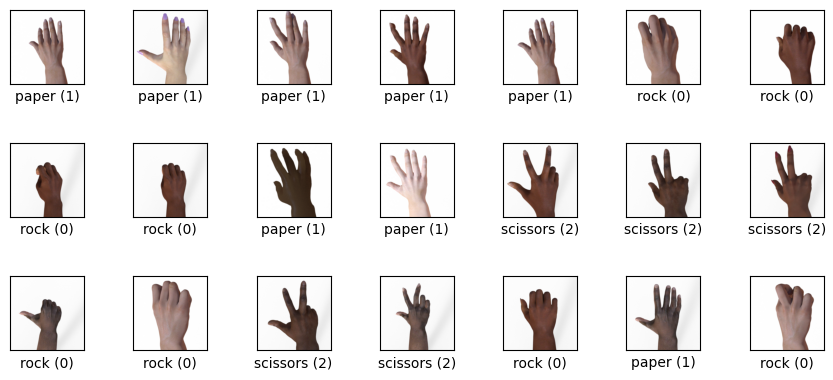

# Image Classification - Rock Paper Scissors

The goal of this project is to train a Machine Learning model (CNN - convolutional neural network) to classify images of rock, paper, and scissors. The dataset is available on the **TensorFlow datasets catalog**: [https://www.tensorflow.org/datasets/catalog/rock_paper_scissors](https://www.tensorflow.org/datasets/catalog/rock_paper_scissors)

The following images shows example images form the dataset. It can be seen that the dataset contains hands in various skin tones capturing wide variety of hand shapes and orientations. The images are `300x300` pixels in size and are in color.	



The dataset itself only contains `test` and `train` splits. 

```	
Number of training (full train) examples: 2520
Number of test examples                 : 372
Ratio test data to (full) train data    : 14.76%
```

When comparing the amount of test data to the amount of training (here referred to as 'full train') data we can see that it is approximately 15% of the training data. Therefore the `train` split is further split into `train` and `validation` splits using 15% of the `train` split for creating the `validation` split.

## Development Environment - EDA and Training

Please refer to the notebook [./eda-training/README.md](./eda-training/README.md) for how to set up the development environment for running the EDA and Model Training.
